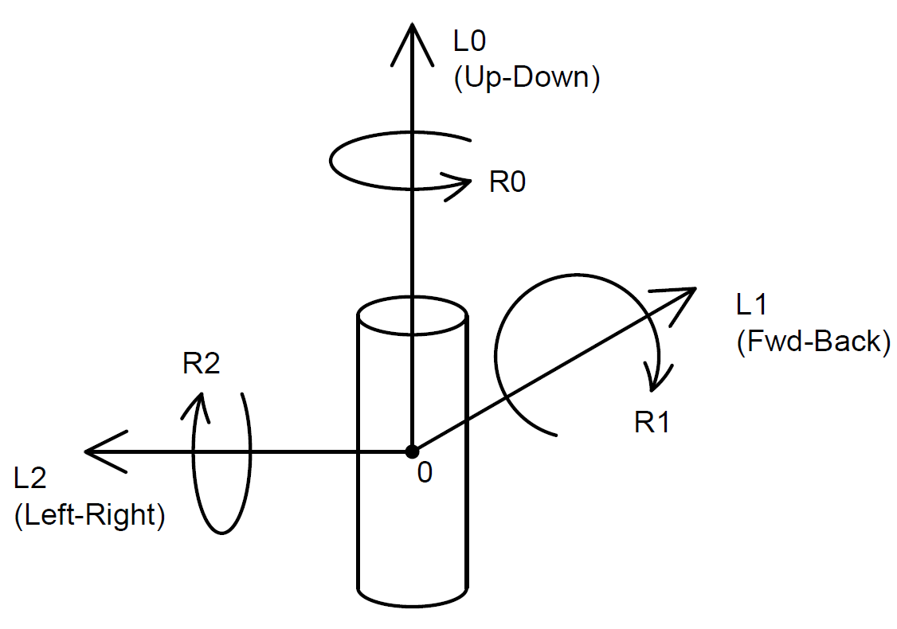

# Toy code ("T-code")

Version 0.3, as of 10th May 2021

## Introduction

T-code is a protocol for implementing UART serial communications to an adult toy. It is partly influenced by G-code, which is an alphanumeric format used to drive CNC machines, including 3D-printers.

The toy or “device” will be capable of one or more functions, which are described as Linear motion, Vibration or Rotation “channels”, which can be addressed independently.

Commands are send to the device in the form of alphanumeric ASCII phrases, which are interpreted by the device, stored in a buffer and executed on the receipt of new line or ‘/n’ character.

## Live control

To be able to keep up with a live feed the commands will need to have a short, quick fire format, for an instant response.

Commands for Linear move, Rotate, Vibrate, and Auxilliary take the form of a letter (“L”, “R”, “V”, or "A") followed by a set of digits. Lower case letters (“l”, “r”, “v”) are also valid.

`L&$$`

The first digit “&” is the channel ID (0-9) and any subsequent digits, two in this case “$$”, are the magnitude. The magnitude for any channel is always a number between 0 and 1. The magnitude digits are therefore effectively the digits following a “0.”

The magnitude corresponds to a linear position/speed, rotation position/speed, or vibration level. In situations where position or speed is possible in a forward or reverse direction 0.5 is assumed to be central or at rest.

* `L277` = Linear, channel ID 2, magnitude 0.77.
* `R09` = Rotate, channel ID 0, magnitude 0.9
* `V317439` = Vibrate, channel ID 3, magnitude 0.17439.

For the fastest response possible during live control each of these commands should be followed immediately by a `\n`

## Magnitude + Time Interval

Magnitude commands can be augmented with a speed term. This commands the toy to ramp to the specified magnitude over an interval of time, given in milliseconds.

eg:
`L&$$I£££`

Where “I” (or “i”) allows the effect to be ramped in over an interval of “£££” milliseconds, starring from the current value.

* `V199I2000` = Vibration, channel ID 1, ramp to 0.99 over 2 seconds.

With this command the channel ramps to the specified level and continues at that level until given further instructions.

## Magnitude + Speed

As an alternative, the rate at which the effect is ramped in can be specified.

`R&$$S£££`

Using “S” (or “s”) allows the effect to be ramped at a speed of “£££” per hundred milliseconds.

`L020S10` = Linear move, channel ID 0, ramp to 0.2 at a rate of 0.1/sec

As with time interval, the channel ramps to the specified level and continues at that level until given further instructions.

## Multiple Channels

Multiple channels can be operated in parallel, and will do so independently of each other. 

Multiple commands can be sent at the same time, separated by a space character ‘ ‘, allowing instructions to be readied for multiple L, R, V & A channels before all are executed by the receipt of a `\n` character. Lag in scripted control can be minimised by sending the next instructions in advance, sending the new line to execute at the desired moment.

Commands addressed to the same channel before a new line character is sent will overwrite previous buffered commands to that channel.

## Multi-Axis Devices 

The default configuration for a Multi Axis Stroker Robot (or "MAxSR") is as follows:

Linear motions in three axes:
* L0 is positive up relative to the user
* L1 is positive moving away from the user
* L2 is positive moving to the user's left

Rotations in three axes:
* R0, R1, R2 are positive according to the right hand rule around L0, L1, L2 respectively.

The minimum position for each axis is 0, the maximum position is 0.9999 (etc). The middle, or neutral, position is 0.5.

Extra functions on the OSR2/SR6:
* V0, V1, are vibration motor control channels
* A0 is direct control of the valve position 
  * The most recent command determines current control method, 0 = open, 9999 = closed
* A1 is suck algorithm control of the valve
  * The most recent command determines current control method, 0 = open, 9999 = closed
* A2 is lube motor speed (0-9999, 0-100%)

## Device commands

Additional instructions to and from the device can be controlled through a predetermined list of commands prefixed with the letter `D` or `d`.

The current list of commands is as follows:

* `D0` - Identify device & firmware version
* `D1` - Identify TCode version
* `D2` - List available axes and associated user range preferences
* `DSTOP` - Stop device

## Save commands

To save a user's preferences to the EEPROM on the OSR2/SR6 on an axis-by-axis basis a save command
can be used. These commands are prefixed by the symbol `$`.

These take the form `$TX-YYYY-ZZZZ`

Where:
* T is the axis type (L, R, V, A)
* X is the axis number (0-9)
* YYYY is the preferred minimum (0000-9999)
* ZZZZ is the preferred maximum (0000-9999)

Note that saved preferences do not change the behaviour of the device itself. They exist as a reference for the driving app or plugin, accessed via the `D2` command.
